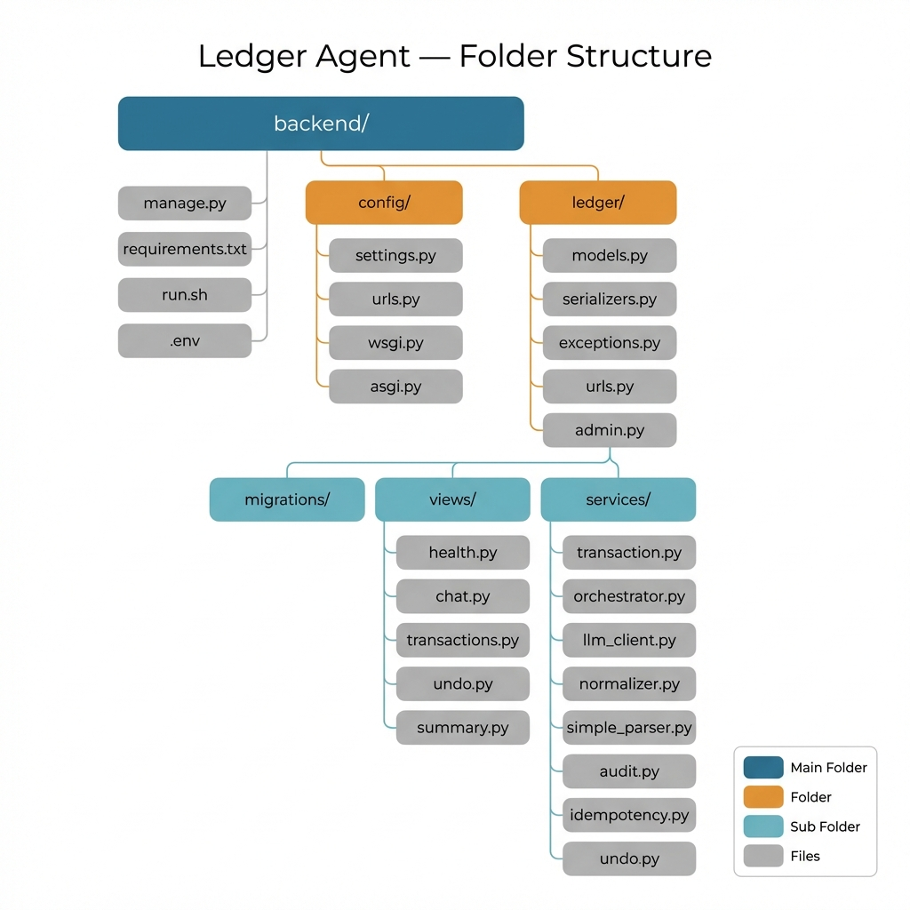
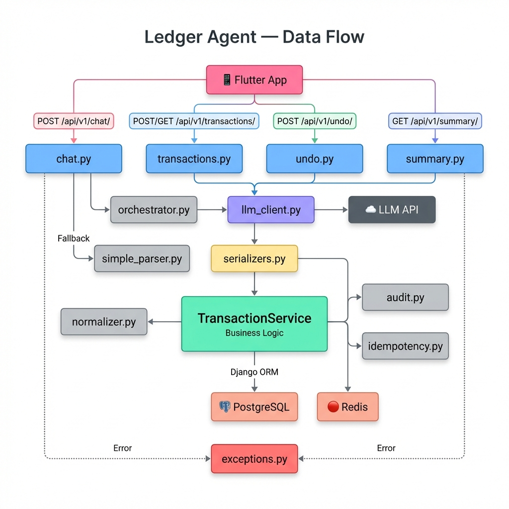
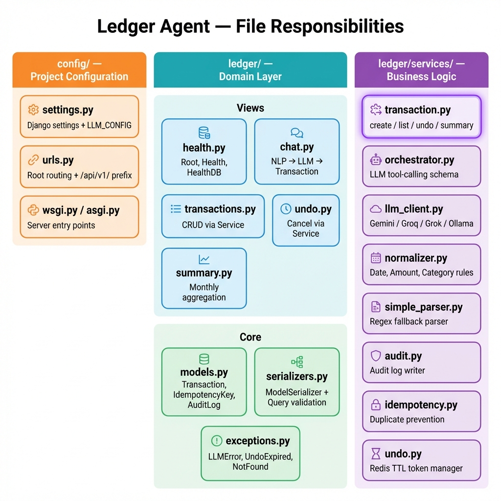

# Ledger Agent — Architecture & Commit Message

## 1. Folder Structure



---

## 2. Data Flow



---

## 3. File Responsibilities



---

## Git Commit Message

```
refactor(backend): restructure Django+DRF architecture to industry standards

BREAKING CHANGE: API endpoints moved under /api/v1/ prefix

## What changed

- Split monolithic views.py (496 lines) into views/ package
  (health, chat, transactions, undo, summary)
- Introduce TransactionService to consolidate duplicated business logic
  from ChatView and TransactionListCreateView (DRY principle)
- Replace manual dict serialization with DRF ModelSerializer
- Add query parameter validation via dedicated Serializers
  (TransactionListQuerySerializer, SummaryQuerySerializer)
- Create custom DRF exceptions (LLMBadRequestError, LLMQuotaExceededError,
  LLMAuthError, UndoTokenExpiredError, TransactionNotFoundError)
- Convert async LLM client to synchronous (remove unstable 3-layer
  asyncio wrapper with ThreadPoolExecutor)
- Standardize URL routing with trailing slashes and /api/v1/ versioning
- Restructure LLM settings into LLM_CONFIG dictionary

## Architecture

  Request → URLs → Thin View → Serializer (validate)
                             → TransactionService (business logic)
                               → normalizer / audit / idempotency / undo
                               → Django ORM → PostgreSQL
                               → Redis (undo tokens)

## Files changed

  NEW:    ledger/views/__init__.py, health.py, chat.py,
          transactions.py, undo.py, summary.py
  NEW:    ledger/exceptions.py
  NEW:    ledger/services/transaction.py
  MOD:    ledger/serializers.py (ModelSerializer + query validators)
  MOD:    ledger/services/llm_client.py (async → sync)
  MOD:    ledger/services/orchestrator.py (remove async wrapper)
  MOD:    ledger/urls.py (trailing slashes + app_name)
  MOD:    config/urls.py (/api/v1/ versioning)
  MOD:    config/settings.py (LLM_CONFIG structure)
  DEL:    ledger/views.py (replaced by views/ package)
```
